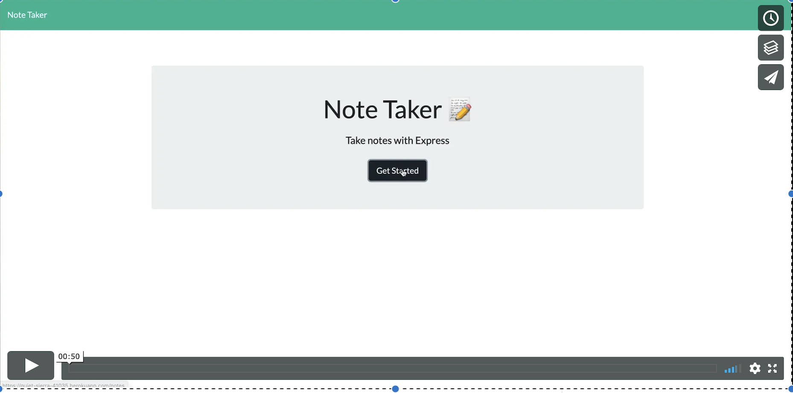

# Note Taker

This is a simple note taking application that allows a user to write, save and delete notes. 

This app is deployed on Heroku via the below link:
https://quiet-sierra-41035.herokuapp.com/

## Instructions
* Clone the application and cd into the "Develop" folder. 
* Install the following dependencies:

   * npm i
   * npm install express
   * npm install node
   * npm install short-id
* Run the node server locally through the following command:
  * node server.js

## Product Demo

 